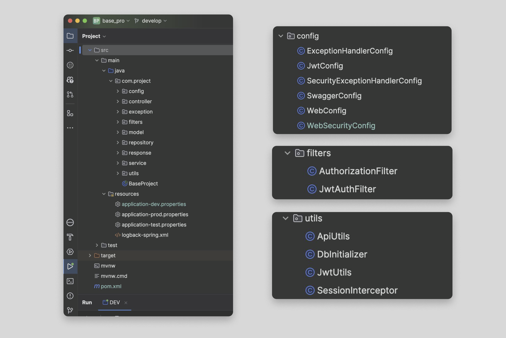
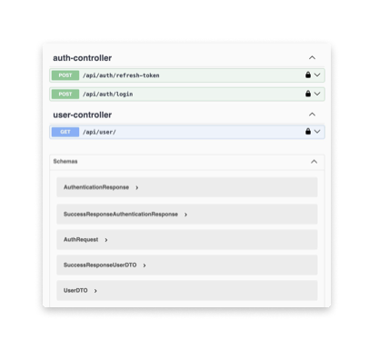

# Guida all'autenticazione sicura con SpringSecurity e JWT Token
## Introduzione
Questa guida descrive l'implementazione di un sistema di autenticazione sicuro utilizzando Spring Security e JWT (JSON Web Tokens) in un'applicazione Spring Boot. 
JWT è un metodo standard aperto (RFC 7519) per la creazione di token di accesso sicuri che possono essere verificati e decodificati facilmente. 
Questa guida copre i seguenti aspetti:

1. Configurazione di Spring Security per l'autenticazione e l'autorizzazione.
2. Generazione e validazione dei token JWT.
3. Protezione delle risorse con JWT.
4. Gestione delle eccezioni di sicurezza.

##  Prerequisiti

* **Java 21**
* **Maven 3.9.8**
* **Spring Boot 3.3.1**
* **MySQL 8.0 o superiore**


## Dipendenze maven necessarie

Il file pom.xml include le seguenti dipendenze chiave:

1. Spring Boot Starter (Web, Data JPA, Security)
2. MySQL Connector
3. Lombok
4. JSON Web Token (JWT)
5. SpringDoc OpenAPI (per Swagger e la documentazione API)

### Setup del Progetto

1. Clona il repository da GitHub:
2. Configura il database: Il file `application-dev.properties` contiene la configurazione per il database MySQL:

```
### properties for dev profile ###

spring.datasource.url=jdbc:mysql://localhost:3306/base_database?createDatabaseIfNotExist=true&useUnicode=yes&characterEncoding=UTF-8
spring.datasource.username=root
spring.datasource.password=^Dvx&5hFzH&s#i

spring.jpa.hibernate.ddl-auto=create-drop
```
3. Configurazione delle variabili d'ambiente (per jwt secret key):
```
### properties for dev profile ###

application.security.jwt-secret-key=amh2amhiamhndmhqZmN2aGd2aHZodmhndmhqNDU2NzhzZHNoY2JmaGRlYmYyMjIy

application.security.jwt-expired-access-token=86400000
application.security.jwt-expired-refresh-token=172800000

```
4. Esegui l'applicazione Spring Boot: `mvn spring-boot:run -Dspring.profiles.active=DEV`.

* Considerazioni:
1. Il database viene creato automaticamente se non esiste *(createDatabaseIfNotExist=true)*.
2. La modalità create-drop ricrea il database ad ogni avvio dell'applicazione. Utile per lo sviluppo, ma non per la produzione.
3. Le credenziali del database sono esposte nel file di configurazione. In un ambiente di produzione, queste dovrebbero essere gestite in modo più sicuro (es. variabili d'ambiente).

#### Inizializzazione del db

La classe `DbInitializer` si occupa di popolare il database con dati iniziali:

Crea ruoli predefiniti (ROLE_USER, ROLE_ADMIN).
Crea utenti di esempio con ruoli assegnati.

##### Punti Chiave:

Utilizza *CommandLineRunner* per eseguire l'inizializzazione all'avvio dell'applicazione.
Verifica l'esistenza dei ruoli/utenti prima di crearli per evitare duplicati.
Utilizza PasswordEncoder per hashare le password degli utenti.La classe DbInitializer si occupa di popolare il database con dati iniziali:

* Crea ruoli predefiniti **(ROLE_USER, ROLE_ADMIN)**.
* Crea utenti di esempio con ruoli assegnati.

# Panoramica dell'Autenticazione con JWT

## Struttura 



L'architettura dell'applicazione è organizzata in modo modulare per separare le responsabilità e facilitare la manutenzione. Ecco una panoramica dei principali componenti:

### Componenti principali schema Security

1. **Configurazione JWT (`JwtConfig.java`)**:
   - Contiene le proprietà di configurazione per JWT come la chiave segreta e la durata dei token.
   - Definisce i nomi dei campi del token JWT.

2. **Utility JWT (`JwtUtils.java`)**:
   - Contiene metodi per generare, validare e estrarre informazioni dai token JWT.

3. **Configurazione di Sicurezza (`WebSecurityConfig.java`)**:
    - Configura la catena di filtri di sicurezza.
    - Disabilita CSRF.
    - Configura la gestione delle sessioni come stateless.
    - Aggiunge il filtro JWT (`JwtAuthFilter`) prima del filtro di autenticazione di Spring (`UsernamePasswordAuthenticationFilter`).
    - Configura i gestori di eccezioni per accessi negati.
    - Configura il provider di autenticazione (`DaoAuthenticationProvider`).

4. **Filtro di Autenticazione JWT (`JwtAuthFilter.java`)**:
    - Estende `OncePerRequestFilter`.
    - Estrae il token JWT dall'header della richiesta.
    - Valida il token e imposta l'autenticazione nel contesto di sicurezza.
    - Gestisce le eccezioni JWT scadute.

5. **Filtro di Autorizzazione (`AuthorizationFilter.java`)**:
    - Estende `OncePerRequestFilter`.
    - Estrae i ruoli e le autorizzazioni dall'utente autenticato.
    - Verifica i ruoli richiesti per accedere alle risorse.
    - Gestisce le eccezioni di accesso negato.

6. **Gestione delle Eccezioni di Sicurezza (`SecurityExceptionHandlerConfig.java`)**:
    - Gestisce le eccezioni di sicurezza e invia risposte di errore personalizzate.

   
## Processo di Autenticazione e Generazione Token JWT

## Login e Generazione Token

1. **Richiesta di Login**
   - L'utente invia una richiesta POST a `/api/auth/login` con le credenziali (email e password).
   - La richiesta viene gestita dal metodo `login()` in `AuthController`.

2. **Autenticazione**
   - `AuthenticationService.authentication()` viene chiamato con le credenziali dell'utente.
   - Il metodo utilizza `AuthenticationManager` per verificare le credenziali:

     ```java
     authenticationManager.authenticate(
         new UsernamePasswordAuthenticationToken(request.getEmail(), request.getPassword())
     );
     ```
   - *Creazione del Token di Autenticazione*: Viene creato un oggetto UsernamePasswordAuthenticationToken utilizzando l'email e la password fornite nella richiesta (request.getEmail() e request.getPassword())
   - *Autenticazione*: L'oggetto authenticationManager chiama il metodo authenticate passando il token di autenticazione appena creato. Questo metodo verifica le credenziali dell'utente.
   - *Verifica delle Credenziali*: Il AuthenticationManager utilizza un AuthenticationProvider (come DaoAuthenticationProvider) per caricare i dettagli dell'utente (ad esempio, da un database) e confrontare la password fornita con quella memorizzata.
   - *Impostazione del Contesto di Sicurezza*: Se l'autenticazione ha successo, il contesto di sicurezza di Spring viene aggiornato con le informazioni dell'utente autenticato, rendendolo disponibile per l'intera sessione.
   
   - Se l'autenticazione fallisce, viene lanciata un'eccezione.

3. **Recupero Utente**
   - Se l'autenticazione ha successo, l'utente viene recuperato dal database:
     ```java
     User user = userRepository.findByEmail(request.getEmail())
             .orElseThrow(() -> new AuthException(new ErrorResponse(ErrorCode.EUN, "user with email not found")));
     ```

4. **Generazione Token**
   - Vengono generati due token utilizzando `JwtUtils`:
      - Access Token: `jwtUtils.generateToken(user)`
      - Refresh Token: `jwtUtils.generateRefreshToken(user)`

5. **Creazione Token JWT**
   - Il metodo `buildToken()` in `JwtUtils` crea il token JWT:
     ```java
     return Jwts.builder()
             .setClaims(extraClaims)
             .setId(String.valueOf(user.getId()))
             .setSubject(user.getUsername())
             .setIssuedAt(new Date(System.currentTimeMillis()))
             .setExpiration(new Date(System.currentTimeMillis() + expiration))
             .signWith(getSignInKey(), SignatureAlgorithm.HS256)
             .compact();
     ```

6. **Risposta**
   - I token generati vengono restituiti al client in un oggetto `AuthenticationResponse`.

## Controllo delle Chiamate Autenticate

Per le chiamate successive che richiedono autenticazione, il processo è il seguente:

1. **Intercettazione della Richiesta**
   - Ogni richiesta passa attraverso `JwtAuthFilter`, che estende `OncePerRequestFilter`.

2. **JwtAuthFilter**
   - Il filtro estrae il token JWT dall'header "Authorization":
     ```java
     final String authHeader = request.getHeader("Authorization");
     if (authHeader == null || !authHeader.startsWith("Bearer ")) {
         // Gestione del caso in cui il token non è presente
     }
     jwt = authHeader.substring(7);
     ```

3. **Validazione del Token**
   - Il token viene validato utilizzando `JwtUtils`:
     ```java
     username = jwtUtils.extractEmail(jwt);
     if (username != null && SecurityContextHolder.getContext().getAuthentication() == null) {
         UserDetails userDetails = customUserDetailsService.loadUserByUsername(username);
         if (jwtUtils.isTokenValid(jwt, userDetails)) {
             // Token valido, procedi con l'autenticazione
         }
     }
     ```

4. **Impostazione dell'Autenticazione**
   - Se il token è valido, viene creato un `UsernamePasswordAuthenticationToken` e impostato nel `SecurityContextHolder`:
     ```java
     UsernamePasswordAuthenticationToken authToken = new UsernamePasswordAuthenticationToken(
         userDetails, null, userDetails.getAuthorities());
     authToken.setDetails(new WebAuthenticationDetailsSource().buildDetails(request));
     SecurityContextHolder.getContext().setAuthentication(authToken);
     ```
5. **AuthorizationFilter**
- Verifica se la richiesta è diretta a un endpoint pubblico: 

```java javaCopyif(Arrays.stream(ApiUtils.PERMIT_ALL).anyMatch(value ->
request.getServletPath().startsWith(value.replace("/**", "")))) {
filterChain.doFilter(request, response);
return;
}
```
- Se non è un endpoint pubblico, procede con la verifica del token.


6. **Verifica Approfondita del Token**

- Estrae nuovamente il token e l'email dell'utente:
```java String token = authorization.substring("Bearer ".length());
String email = jwtUtils.extractEmail(token);
``` 

- Carica i dettagli dell'utente usando `CustomUserDetailsService`:
```java UserDetails user = userDetailsService.loadUserByUsername(email);
```

7. **Caricamento Dettagli Utente**

CustomUserDetailsService.loadUserByUsername()` viene chiamato:
```java public UserDetails loadUserByUsername(String email) throws UsernameNotFoundException {
return userRepository.findByEmail(email).orElseThrow(() -> new UserException(
new ErrorResponse(ErrorCode.EUN, "User not found with email: " + email)
));
}
``` 
- Questo metodo recupera l'utente completo dal database.


8. **Validazione Finale e Impostazione Autenticazione**

- Verifica ulteriormente la validità del token:
```java if (jwtUtils.isTokenValid(token, user)) {
UsernamePasswordAuthenticationToken authToken =
new UsernamePasswordAuthenticationToken(email, user.getPassword(), user.getAuthorities());
authToken.setDetails(new WebAuthenticationDetailsSource().buildDetails(request));
SecurityContextHolder.getContext().setAuthentication(authToken);
```

- Imposta l'autenticazione completa nel `SecurityContextHolder` con tutti i dettagli dell'utente.

9. **Proseguimento della Richiesta**

- Se tutte le verifiche passano, la richiesta procede al controller desiderato. 

- Questo processo assicura che solo le richieste con un token JWT valido possano accedere alle risorse protette dell'applicazione.


# Gestione delle Eccezioni

Il sistema implementa una gestione robusta e personalizzata delle eccezioni per garantire risposte coerenti e informative in caso di errori.

## Componenti Principali

### 1. ExceptionHandlerConfig

Questa classe è annotata con `@RestControllerAdvice` e gestisce varie eccezioni a livello globale dell'applicazione.

Principali eccezioni gestite:
- `UserException` e `InternalAuthenticationServiceException`
- `NoHandlerFoundException`
- `MethodArgumentNotValidException`
- `HttpMessageNotReadableException`
- `MissingRequestHeaderException`
- `BadCredentialsException`
- `NoSuchElementException`
- `UsernameNotFoundException`
- `ExpiredJwtException`

Ogni eccezione viene mappata su una `ErrorResponse` appropriata.

### 2. SecurityExceptionHandlerConfig

Gestisce specificamente le eccezioni di sicurezza, fornendo una risposta JSON formattata.

```java
@Component
public class SecurityExceptionHandlerConfig {
    public void handle(HttpServletResponse response, ErrorResponse errorResponse) throws IOException {
        // Formatta e invia la risposta di errore
    }
}
```

### 3. ErrorCode

Un enum che definisce i codici di errore standardizzati utilizzati nell'applicazione:

```java
public enum ErrorCode {
    FB("Forbidden", HttpStatus.FORBIDDEN, ExitCode.KO),
    UA("Unauthorized", HttpStatus.UNAUTHORIZED, ExitCode.KO),
    INT("Invalid Token", HttpStatus.UNAUTHORIZED, ExitCode.KO),
    EXT("Expired Token", HttpStatus.UNAUTHORIZED, ExitCode.KO),
    // ... altri codici di errore
}
```

### 4. ErrorResponse

Una classe che struttura la risposta di errore:

```java
public class ErrorResponse {
    private ErrorCode errorCode;
    private String message;
    private HttpStatus status;
    private Integer statusCode;
    // ... costruttori e metodi
}
```

## Flusso di Gestione delle Eccezioni

1. **Lancio dell'Eccezione**: Un'eccezione viene lanciata durante l'esecuzione del codice.

2. **Intercettazione**: `ExceptionHandlerConfig` intercetta l'eccezione.

3. **Mappatura**: L'eccezione viene mappata su un `ErrorCode` appropriato.

4. **Creazione della Risposta**: Viene creato un oggetto `ErrorResponse` con i dettagli dell'errore.

5. **Logging**: I dettagli dell'errore vengono registrati per il debugging.

6. **Invio della Risposta**: La risposta di errore viene inviata al client in formato JSON.

## Esempi di Gestione

### Gestione di JWT Scaduto

```java
@ExceptionHandler(ExpiredJwtException.class)
public ResponseEntity<ErrorResponse> expiredJwtException(ExpiredJwtException e) {
    ErrorResponse errorResponse = new ErrorResponse(ErrorCode.EXT, getMessage(e));
    logStacktrace(errorResponse, e);
    return new ResponseEntity<>(errorResponse, errorResponse.getStatus());
}
```

### Gestione di Credenziali Non Valide

```java
@ExceptionHandler(BadCredentialsException.class)
public ResponseEntity<ErrorResponse> badCredentialsException(BadCredentialsException e) {
    ErrorResponse errorResponse = new ErrorResponse(ErrorCode.EBC, getMessage(e));
    logStacktrace(errorResponse, e);
    return new ResponseEntity<>(errorResponse, errorResponse.getStatus());
}
```

## Best Practices Implementate

1. **Standardizzazione degli Errori**: Utilizzo di `ErrorCode` per standardizzare i messaggi di errore.
2. **Logging Dettagliato**: Registrazione dello stack trace per un debugging efficace.
3. **Risposte Coerenti**: Tutte le risposte di errore seguono lo stesso formato.
4. **Sicurezza**: Gli errori non espongono dettagli sensibili del sistema.

## Considerazioni per il Miglioramento

- Implementare un meccanismo per la traduzione dei messaggi di errore in diverse lingue.
- Aggiungere più dettagli nei log per facilitare il monitoraggio e l'analisi degli errori in produzione.
- Considerare l'implementazione di un sistema di notifica per errori critici.

### Test API con Swagger

Swagger è integrato nell'applicazione per testare le API e visualizzare la documentazione. Puoi accedere a Swagger all'indirizzo `http://localhost:8080/swagger-ui.html`.


