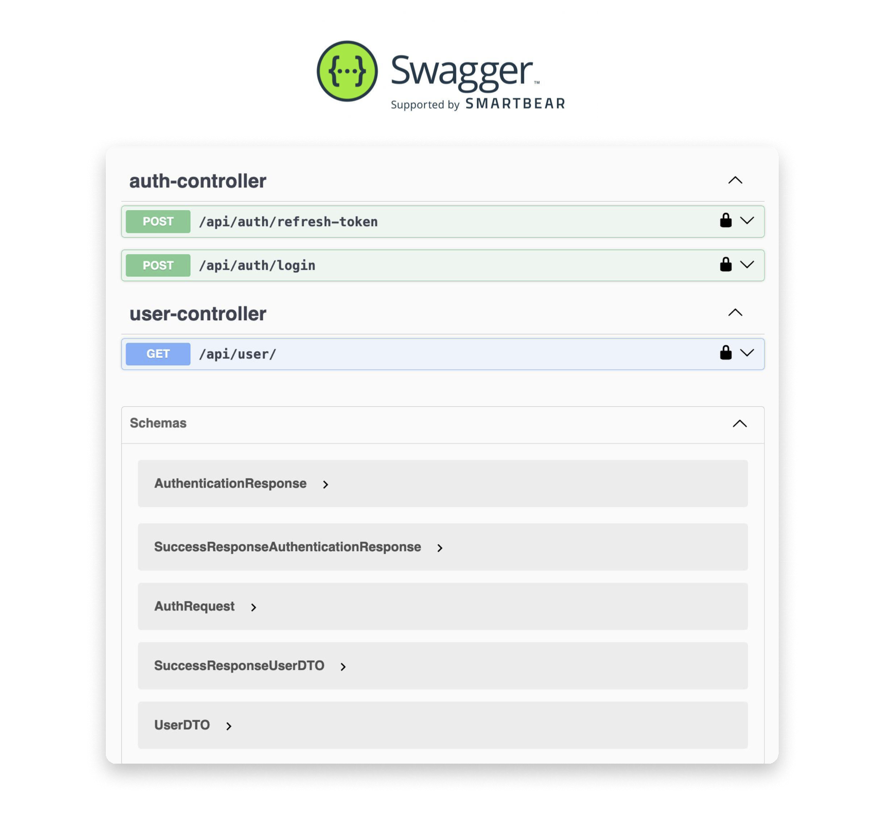

# Guida all'autenticazione sicura con SpringSecurity e JWT Toekn
## Introduzione
Questa guida descrive l'implementazione di un sistema di autenticazione sicuro utilizzando Spring Security e JWT (JSON Web Tokens) in un'applicazione Spring Boot. 
JWT è un metodo standard aperto (RFC 7519) per la creazione di token di accesso sicuri che possono essere verificati e decodificati facilmente. 
Questa guida copre i seguenti aspetti:

1. Configurazione di Spring Security per l'autenticazione e l'autorizzazione.
2. Generazione e validazione dei token JWT.
3. Protezione delle risorse con JWT.
4. Gestione delle eccezioni di sicurezza.

##  Prerequisiti

* **Java 21**
* **Maven 3.9.8**
* **Spring Boot 3.3.1**
* **MySQL 8.0 o superiore**


## Dipendenze maven necessarie

Il file pom.xml include le seguenti dipendenze chiave:

1. Spring Boot Starter (Web, Data JPA, Security)
2. MySQL Connector
3. Lombok
4. JSON Web Token (JWT)
5. SpringDoc OpenAPI (per Swagger e la documentazione API)

### Setup del Progetto

1. Clona il repository da GitHub:
2. Configura il database: Il file `application-dev.properties` contiene la configurazione per il database MySQL:

```
### properties for dev profile ###

spring.datasource.url=jdbc:mysql://localhost:3306/base_database?createDatabaseIfNotExist=true&useUnicode=yes&characterEncoding=UTF-8
spring.datasource.username=root
spring.datasource.password=^Dvx&5hFzH&s#i

spring.jpa.hibernate.ddl-auto=create-drop
```
3. Configurazione delle variabili d'ambiente (per jwt secret key):
```
### properties for dev profile ###

application.security.jwt-secret-key=amh2amhiamhndmhqZmN2aGd2aHZodmhndmhqNDU2NzhzZHNoY2JmaGRlYmYyMjIy

application.security.jwt-expired-access-token=86400000
application.security.jwt-expired-refresh-token=172800000

```
4. Esegui l'applicazione Spring Boot: `mvn spring-boot:run -Dspring.profiles.active=DEV`.

* Considerazioni:
1. Il database viene creato automaticamente se non esiste *(createDatabaseIfNotExist=true)*.
2. La modalità create-drop ricrea il database ad ogni avvio dell'applicazione. Utile per lo sviluppo, ma non per la produzione.
3. Le credenziali del database sono esposte nel file di configurazione. In un ambiente di produzione, queste dovrebbero essere gestite in modo più sicuro (es. variabili d'ambiente).

#### Inizializzazione del db

La classe `DbInitializer` si occupa di popolare il database con dati iniziali:

Crea ruoli predefiniti (ROLE_USER, ROLE_ADMIN).
Crea utenti di esempio con ruoli assegnati.

##### Punti Chiave:

Utilizza *CommandLineRunner* per eseguire l'inizializzazione all'avvio dell'applicazione.
Verifica l'esistenza dei ruoli/utenti prima di crearli per evitare duplicati.
Utilizza PasswordEncoder per hashare le password degli utenti.La classe DbInitializer si occupa di popolare il database con dati iniziali:

* Crea ruoli predefiniti **(ROLE_USER, ROLE_ADMIN)**.
* Crea utenti di esempio con ruoli assegnati.

## Progetto security

### Struttura del Progetto


L'architettura dell'applicazione è organizzata in modo modulare per separare le responsabilità e facilitare la manutenzione. Ecco una panoramica dei principali componenti:

### Componenti principali
1. **Configurazione di Sicurezza (`WebSecurityConfig.java`)**:
    - Configura la catena di filtri di sicurezza.
    - Disabilita CSRF.
    - Configura la gestione delle sessioni come stateless.
    - Aggiunge il filtro JWT (`JwtAuthFilter`) prima del filtro di autenticazione di Spring (`UsernamePasswordAuthenticationFilter`).
    - Configura i gestori di eccezioni per accessi negati.
    - Configura il provider di autenticazione (`DaoAuthenticationProvider`).

2. **Filtro di Autenticazione JWT (`JwtAuthFilter.java`)**:
    - Estende `OncePerRequestFilter`.
    - Estrae il token JWT dall'header della richiesta.
    - Valida il token e imposta l'autenticazione nel contesto di sicurezza.
    - Gestisce le eccezioni JWT scadute.

3. **Gestione delle Eccezioni di Sicurezza (`SecurityExceptionHandlerConfig.java`)**:
    - Gestisce le eccezioni di sicurezza e invia risposte di errore personalizzate.

4. **Utilità JWT (`JwtUtils.java`)**:
    - Contiene metodi per generare, validare e estrarre informazioni dai token JWT.

5. **Servizio di Dettagli Utente Personalizzato (`CustomUserDetailsService.java`)**:
    - Implementa `UserDetailsService` per caricare i dettagli dell'utente dal database.

6. **Controller di Autenticazione (`AuthController.java`)**:
    - Gestisce le richieste di login e refresh token.
    - Utilizza `AuthenticationService` per autenticare gli utenti e generare token JWT.

7. **Configurazione JWT (`JwtConfig.java`)**:
    - Contiene le proprietà di configurazione per JWT come la chiave segreta e la durata dei token.

### Configurazione JWT
TODO: approfondire

### Processo di Autenticazione

Il processo di autenticazione con JWT in Spring Security segue questi passaggi:

1. **Login**:
    - L'utente invia una richiesta di login con le credenziali (username e password) al `AuthController`.
    - Il `AuthController` chiama il `AuthenticationService` per autenticare l'utente.
    - Se le credenziali sono valide, viene generato un token JWT utilizzando `JwtUtils` e restituito all'utente.

2. **Autenticazione delle Richieste**:
    - Ogni richiesta successiva deve includere il token JWT nell'header `Authorization`.
    - Il `JwtAuthFilter` intercetta la richiesta, estrae e valida il token JWT.
    - Se il token è valido, l'utente viene autenticato e l'autenticazione viene impostata nel contesto di sicurezza di Spring.

3. **Gestione delle Eccezioni**:
    - Se il token JWT è scaduto o non valido, il `JwtAuthFilter` gestisce l'eccezione e invia una risposta di errore personalizzata utilizzando `SecurityExceptionHandlerConfig`.

4. **Accesso alle Risorse**:
    - Le richieste vengono autorizzate in base ai ruoli e alle autorizzazioni configurate in `WebSecurityConfig`.
    - Le risorse protette richiedono un token JWT valido per l'accesso.

### Esempio di Codice

```java
// AuthController.java
@RestController
@RequestMapping("/api/auth")
public class AuthController {
    @Autowired
    private JwtUtils jwtUtils;
    @Autowired
    private AuthenticationService authenticationService;

    @PostMapping("/login")
    public ResponseEntity<SuccessResponse<AuthenticationResponse>> login(@RequestBody AuthRequest request) {
        return new ResponseEntity<>(new SuccessResponse<>(authenticationService.authentication(request)), HttpStatus.OK);
    }

    @PostMapping("/refresh-token")
    public ResponseEntity<SuccessResponse<AuthenticationResponse>> refreshToken(HttpServletRequest request) {
        return new ResponseEntity<>(new SuccessResponse<>(authenticationService.refreshToken(request)), HttpStatus.OK);
    }
}
```

```java
// JwtAuthFilter.java
@Component
public class JwtAuthFilter extends OncePerRequestFilter {
    @Autowired
    private JwtUtils jwtUtils;
    @Autowired
    private SecurityExceptionHandlerConfig securityExceptionHandlerConfig;
    @Autowired
    private CustomUserDetailsService customUserDetailsService;

    @Override
    protected void doFilterInternal(@NonNull HttpServletRequest request, @NonNull HttpServletResponse response, @NonNull FilterChain filterChain) throws ServletException, IOException {
        final String authHeader = request.getHeader("Authorization");
        final String jwt;
        final String username;
        if (authHeader == null || !authHeader.startsWith("Bearer ")) {
            if (Arrays.stream(ApiUtils.PERMIT_ALL).anyMatch(value -> request.getServletPath().startsWith(value.replace("/**", "")))) {
                filterChain.doFilter(request, response);
            } else {
                securityExceptionHandlerConfig.handle(response, new ErrorResponse(ErrorCode.UA));
            }
            return;
        }
        jwt = authHeader.substring(7);
        try {
            username = jwtUtils.extractEmail(jwt);
        } catch (ExpiredJwtException e) {
            securityExceptionHandlerConfig.handle(response, new ErrorResponse(ErrorCode.EXT));
            return;
        }
        if (username != null && SecurityContextHolder.getContext().getAuthentication() == null) {
            UserDetails userDetails = customUserDetailsService.loadUserByUsername(username);
            if (jwtUtils.isTokenValid(jwt, userDetails)) {
                UsernamePasswordAuthenticationToken authToken = new UsernamePasswordAuthenticationToken(userDetails, null, userDetails.getAuthorities());
                authToken.setDetails(new WebAuthenticationDetailsSource().buildDetails(request));
                SecurityContextHolder.getContext().setAuthentication(authToken);
                request.setAttribute("id", jwtUtils.getIdFromJwtToken(jwt));
            }
        }
        filterChain.doFilter(request, response);
    }
}
```

```java
// JwtUtils.java
@Component
public class JwtUtils {
    @Value("${application.security.jwt-secret-key}")
    private String jwtSecretKey;

    public String extractEmail(String token) {
        return extractClaim(token, Claims::getSubject);
    }

    public <T> T extractClaim(String token, Function<Claims, T> claimsResolver) {
        final Claims claims = extractAllClaims(token);
        return claimsResolver.apply(claims);
    }

    private Claims extractAllClaims(String token) {
        return Jwts.parser().setSigningKey(jwtSecretKey).parseClaimsJws(token).getBody();
    }

    public Boolean isTokenValid(String token, UserDetails userDetails) {
        final String username = extractEmail(token);
        return (username.equals(userDetails.getUsername()) && !isTokenExpired(token));
    }

    private Boolean isTokenExpired(String token) {
        return extractExpiration(token).before(new Date());
    }

    public Date extractExpiration(String token) {
        return extractClaim(token, Claims::getExpiration);
    }

    public String getIdFromJwtToken(String token) {
        return extractClaim(token, Claims::getId);
    }
}
```

### Gestione delle eccezioni

### Test API con Swagger

Swagger è integrato nell'applicazione per testare le API e visualizzare la documentazione. Puoi accedere a Swagger all'indirizzo `http://localhost:8080/swagger-ui.html`.
TODO: aggiungere immagine di Swagger

